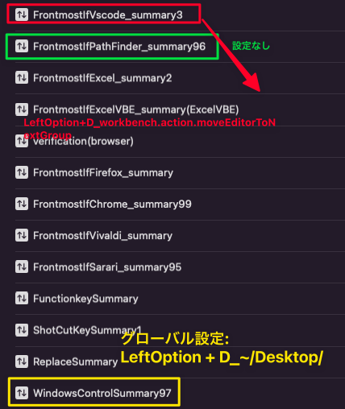

## ルールがまとめて設定されているファイル

/Users/user/.config/karabiner/karabiner.json

---------------------
## フォークしてレポジトリを準備する

1. GitHubの KE-complex_modifications へ行ってレポジトリをFork

https://github.com/pqrs-org/KE-complex_modifications

2. Fork選択


3. Settings


4. Visit site


(参考)<br>
https://rcmdnk.com/blog/2017/08/30/computer-mac-karabiner/#%E3%83%95%E3%82%A9%E3%83%BC%E3%82%AF%E3%81%97%E3%81%A6%E3%83%AC%E3%83%9D%E3%82%B8%E3%83%88%E3%83%AA%E3%82%92%E6%BA%96%E5%82%99%E3%81%99%E3%82%8B

---------------------
## KE-complex_modifications を自分のレポジトリにForkしたURL

https://github.com/sisui198202/KE-complex_modifications

---------------------
Karabiner Elements の独自ルールを追加、デフォルトディレクトリ先

~/.config/karabiner/assets/complex_modifications/

(参考)<br>
https://zenn.dev/yuichkun/articles/6778b0f88e0629

---------------------
## Karaviner_キー作成仕方

1. 編集
2. make
3. karg
4. karu
5. インストール

---------------------
## 確認要1

% cd ~/Users/user/.config/karabiner/assets/

---------------------
## 追加でショットカットキーを登録する時の手順

1. 既存の登録分を削除
2. 新規登録分をインストール

※ この手順ですると、既存の登録分の位置にインストール分をインストールされ、インストール位置に手動で操作の手間が省ける。

---------------------
## frontmost_finder.json.erb　でショットカットキー登録できない

correct formatとエラー表示

代用として、「tesuto.json.erb」でショットカットキー登録すること

---------------------
## 一括設定

replacekeysummary.json

shotcutkeysummary.json

window_control.json

(注)
"_comment": "",を入れていると、うまく設定が反映されない。

---------------------
## 個別設定

frontmost_~.json

replacekey.json

shotcutkey.json

double_push_key.json

---------------------

## 個別登録から一括登録に書換方法

1. 「description」プロパティ行を切取
2. 「"manipulators"」の配列内のオブジェクト行にコピペ
3. 個別登録ファイル側「"manipulators"」の配列内のオブジェクト行を一括登録側ファイルの「manipulators」に貼付


---------------------
## 1つ説明で複数の設定を入力するパターン

```
{
    "title": "<タイトル>",
    "rules": [
      {
        "description": "<説明>",
        "manipulators": [

        ]
      }
    ]
}
```

ex)<br>
```
{
  "title": "WindowControl123",
  "rules": [
              {
                "description": "Fn + ~_WindowsControl(WindowControl)",
                "manipulators": [
                  {
                    "description": "Fn + U_WindowLeftUp",
                    "type": "basic",
                    "from": <%= from("u", ["fn"], ["caps_lock"]) %>,
                    "to": <%= to([["6", "right_alt"]]) %>
                  },
                  {
                    "description": "Fn + H_LeftWindowMove",
                    "type": "basic",
                    "from": <%= from("h", ["fn"], ["caps_lock"]) %>,
                    "to": <%= to([["2", ["right_alt"]]]) %>
                  }
              ]
              }
          ]
}
```
---------------------
## 1つ説明で1つの設定を入力するパターン

{
    "title": "FrontmostIfPararel",
    "rules": [
      {
        "description": "LeftCommand + W_CurrentCursol-EndRowSelect(Pararell)",
        "manipulators": [
          {
            "type": "basic",
            "from": <%= from("w", ["left_control"], ["caps_lock"]) %>,
            "to": <%= to([["equal_sign", "left_option"]]) %>,
            "conditions": [ <%= frontmost_application_if("pararell") %>]
          }
        ]
      },
      {
        "description": "RightCommand + ._MaxWindows(Pararell)",
        "manipulators": [
          {
            "type": "basic",
            "from": <%= from("period", ["right_gui"], ["caps_lock"]) %>,
            "to": <%= to([["1", "left_option"]]) %>,
            "conditions": [ <%= frontmost_application_if("pararell") %>]
          }
        ]
      }
    ]
}

---------------------
[Exploer]
com.parallels.winapp.b06b57f82d7f519cdfa3013b29968f3d.b9dc48efd5094ca8a69c0e98f2ecf717

[Sublime]
com.parallels.winapp.7d56d4002964a683f165ae699d4ad1ba.b9dc48efd5094ca8a69c0e98f2ecf717

[Vscode]
com.parallels.winapp.d51a768a01445deddc409dc4b3c07517.b9dc48efd5094ca8a69c0e98f2ecf717

[Excel]
com.parallels.winapp.c1d81af5835844b4e9d936910ded8fdc.b9dc48efd5094ca8a69c0e98f2ecf717

[Access]
com.parallels.winapp.bf733d8a933c1601697f364223fc7ecb.b9dc48efd5094ca8a69c0e98f2ecf717

[ファイル名を指定して実行]
com.parallels.winapp.2d457b859f61df5cdc0ae605436482d3.b9dc48efd5094ca8a69c0e98f2ecf717.fs

[Uws2Exe_uwscのExe化をするツール]
com.parallels.winapp.f900d466e8ca2c668fa8844e6e5205f3.b9dc48efd5094ca8a69c0e98f2ecf717

[メモ帳]
com.parallels.winapp.ee162c85923f5664be0dcc14062cc904.b9dc48efd5094ca8a69c0e98f2ecf717

[SSMS]
com.parallels.winapp.5f30debe0c2949158e0cff8dc0684bbb.b9dc48efd5094ca8a69c0e98f2ecf717

[Chrome_Windows]
com.parallels.winapp.76868ae832f6c6bd26cadc7d7c269986.b9dc48efd5094ca8a69c0e98f2ecf717

[PowerShell]
com.parallels.winapp.bf448b76d11422f4a518bec20eb47937.b9dc48efd5094ca8a69c0e98f2ecf717

[qdir]
com.parallels.winapp.cc097fe29f445d49eb74bd5993a02853.b9dc48efd5094ca8a69c0e98f2ecf717

---------------------
# 固定アプリとパブリックのキーバインド設定の適用順位について

(上に、パブリックキーバインド設定があるため、固定アプリキーバインド設定は適用できない)
1. パブリックキーバインド設定

2. 固定アプリキーバインド設定


(上に、固定アプリキーバインド設定があるため、固定アプリキーバインド設定も適用できるし、パブリックキーバインド設定も適用される)

1. 固定アプリキーバインド設定

2. パブリックキーバインド設定


* パブリックキーバインド設定を一番下に配置するようにした方が良い。

---------------------
# Profilesについて

JupyterLabを使用する。

tesutoは、テスト用のプロファイルとして使用する。理由は、Complex modificationsのEnable rulesで新規のルールを追加して、追加したルールが適用できているかを検証する場合にUpで一番上にのっていかないと適用できないケースがあるため。

---------------------
## capslockがオンの時、f7で起動し、capslockがオフの時はpublicで指定したf7の挙動

```
{
  "description": "F7_ステップアウト(intellij)",
  "manipulators": [
    {
      "type": "basic",
      "from": <%= from("f7", ["caps_lock"]) %>,
      "to": <%= to([["2", ["right_gui","right_option"]]]) %>,
      "conditions": [ <%= frontmost_application_if("intellij") %> ]
    }
  ]
}
```

---------------------
## WindowsのChromeでインストールする必要があるのにMacのChromeでインストールしてしまうのを防ぐ為に下記の2を使用していたが、インストールする頻度が少ない為、MacChromeで統一させる

    {
      "description": "LeftOption + J_ChromeActiveWindow1(WindowControl)",
      "_comment": "WindowsのChromeでインストールする必要があるのにMacのChromeでインストールしてしまうのを防ぐ為に下記の2を使用していたが、インストールする頻度が少ない為、MacChromeで統一させる",
      "type": "basic",
      "from": <%= from("j", ["left_alt"], ["caps_lock"]) %>,
      "to": <%= set_shell_command(["open -a 'Google Chrome.app'"]) %>
    },
---------------------
## コメント入力だと反応しない為、ここにメモ

        {
	"description": "RightCommand + A_NewFileCreate(VirtualMachine)",
	"_comment": "Windowsのvscodeで新規ファイルを作成するショットカットキーの為にこの設定が必要",
          "type": "basic",
          "from": <%= from("a", ["right_gui"], ["caps_lock"]) %>,
          "to": <%= to([["n", ["right_option"]]]) %>,
          "conditions": [ <%= frontmost_application_if("virtual_machine") %>]
        },

---------------------
## コメント入力だと反応しない為、ここにメモ

        {
	"description": "RightCommand + i_Neight bour(VirtualMachine)",
	"_comment": "WindowsSublimeの右のエディターにカーソル移動",
          "type": "basic",
          "from": <%= from("i", ["right_gui"], ["caps_lock"]) %>,
          "to": <%= to([["i", ["right_control"]]]) %>,
          "conditions": [ <%= frontmost_application_if("virtual_machine") %> ]
        },
---------------------
## "LeftCommand + J_DownArrow_X1(Chrome)"が"LeftCommand + J_DownArrow_X3(Chrome)"に上書きされる仕様

      {
        "description": "LeftCommand + J_DownArrow_X1(Chrome)",
        "manipulators": [
          {
            "type": "basic",
            "from": <%= from("j",["left_control"]) %>,
            "to": <%= to([["down_arrow"]]) %>,
            "conditions": [ <%= frontmost_application_if("chrome") %> ]

          }
        ]
      },
      {
        "description": "LeftCommand + J_DownArrow_X3(Chrome)",
        "manipulators": [
          {
            "type": "basic",
            "from": <%= from("j",["left_control"],["caps_lock"]) %>,
            "to": <%= to([["down_arrow"],["down_arrow"],["down_arrow"]]) %>,
            "conditions": [ <%= frontmost_application_if("chrome") %> ]

          }
        ]
      },
---------------------
## mandatoryを無しで「key_code」単独で、「caps_lock」を設定したい場合

下記のような書き方はできない。
"from": <%= from("a", ["left_control"]) %>,


下記のような書き方が必要。
      "manipulators": [
        {
          "type": "basic",
          "from": {
            "key_code": "fn",
            "modifiers": {
              "optional": [
                "caps_lock"
              ]
            }
          },

---------------------
## karavinerの特定アプリ内のショットカットキーを設定する時に、そのアプリの初期設定ショットカットキーを使う

そのアプリの初期設定のショットカットキーで、karaviner設定した方が
そのアプリが初期状態になっても、そのままkaraviner設定が反映されるので便利

---------------------
## Windowsの新たなツールで日本語アルファベット切り替え、2重貼り付けを防ぐ方法

1. 新たなツールのウィンドウIDを、karaviner-EventViewrのFromntmost Application内のBundle Identiferを確認

2. 確認したidに ^ + id + $に加工

3. 3-1:日本語切り替えできるようにする方法: frontmost_pararelldesk.json内のコマンドキーを単体で押したときに、英数・かなキーを送信する。内にあるbundle_identifiersに加工した分を追加

   3-2:2重貼り付けを防ぐ方法:RightOption_Paste(Replacekey)内にあるbundle_identifiersに加工分を追加

---------------------
<div style="page-break-before:always"></div>

## 新ウィンドウのインストールファイル登録

[index.html.erb]
```
add_group("<インストール画面タイトル>", "frontmost_band_setting", [
  "<ファイル名(.erv除く)>",
])
```

ex)<br>
```
add_group("Frontmost_Band", "frontmost_band_setting", [
  "frontmost_band.json",
])
```

[インストール画面_新ウィンドウタイトル名]


[新ウィンドウルールファイル]


---------------------
## pathfinderで指定ディレクトリ開く場合2パターン

1. alfredのworkflowでopenfileオブジェクトでHotkey呼び出しの方が早く指定ディレクトリが開く

2. karavinerでコマンドで指定ディレクトリを開くのは遅くて使い物にならない

---
## 「~/Desktop/」と 「workbench.action.moveEditorToNextGroup」競合設定



1. vscode:LeftOption + D_workbench.action.moveEditorToNextGroup
2. pathfinder:設定なし
3. global:LeftOption + D_~/Desktop/

---